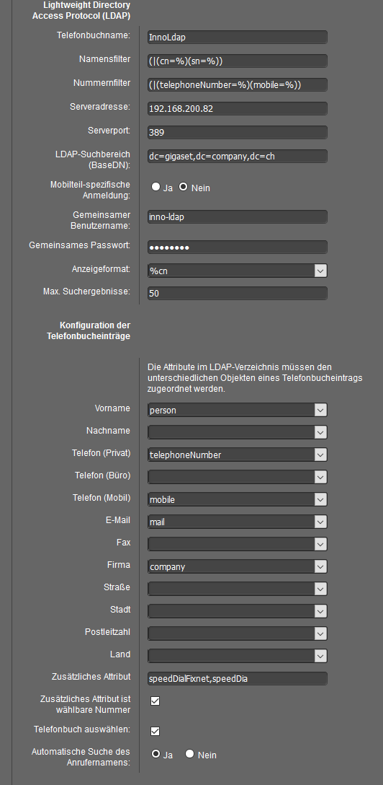

# Install instructions:

## Prerequisites:
- A working LinuxAP or other Perl executable platform
- SSH an SFTP access to the LinuxAP
- root login to the LinuxAP to install it

- Set the ldap user name and password you wish to use for LDAP access
  inside of InnoLdapServer.pm
	my $ldapUserName= 'ldap-user-name';
	my $ldapUserPassword= 'ldap-user-password';

- If you wish to use the tel.search.ch for reverse lookup of phone numbers, please
  get a API key from http://tel.search.ch/api/getkey.en.html and put it in the 
  $apiKeyTelsearch variable inside of InnoLdapServer.pm
  
- In the InnoLdapServer.pm also configure your MySQL login data (Which we will create later)
  If not needed you can leave them but set $useDBSearch to 0 to disable it
  
- In the file ldap-server/db/includes/dbconn.inc.php set the database name and db login credentials

- Upload all files from the ldap-server directory to /var/local/aarldap
- Upload all files from the ldap-server/db directory to /var/www/innovaphone/apps/phonebook

- Login with ssh to your LinuxAP
- change to the /var/local/aarldap directory
  cd /var/local/aarldap
- Make the service file executable
  chmod a+x inno-ldap
  chmod a+x inno-ldap.pl
- Install required packages for the ldap server
  apt-get update
  apt-get install libnet-server-perl libnet-ldap-server-perl libnet-daemon-perl libproc-daemon-perl
  apt-get install libclass-dbi-mysql-perl libxml-xpath-perl libfile-pid-perl
  apt-get install libfile-cache-perl libcache-cache-perl libdatetime-perl
- Link start script to /etc/init.d
  ln -s -t /etc/init.d /var/local/aarldap/inno-ldap
- Make sure ldap service starts on boot
  update-rc.d  inno-ldap defaults
- Make log directory
  mkdir /var/log/innoldap
- Start the service
  service inno-ldap start
  
- Install the MySQL Database
  apt-get install mysql-server
- Create mySQL database and user with password
  mysql -u root
  CREATE USER 'inno-ldap-db'@'localhost' IDENTIFIED BY 'inno-ldap-db';
  GRANT ALL ON phonebook_innovaphone.* TO 'inno-ldap-db'@'localhost';
  FLUSH PRIVILEGES;
  source /var/www/innovaphone/apps/phonebook/phonebook.sql
  exit

- Set PHP rights for DB web gui
  chown www-data:www-data /var/www/innovaphone/apps/phonebook -R
- Install php5 mysql and ldap libraries
  apt-get install php5-mysql php-http php5-ldap
- Restart webserver to use new php libraries
  service lighttpd restart
  
- Test the php script
  Enter http://<lapgv-ip>/apps/phonebook/script.php in a webbrowser
  Upload the testdata.xlsx file, it should show the imported addresses on the bottom of the screen
  
  
On the PBX you have to configure the external LDAP service like this:
- IP of your LinuxAP
- Port 636 with TLS (Or 389 without encryption)
- Username & Password
- Search base dc=company,dc=ch
- Mode basic
Name Attributes company,givenName,sn
Number Attributes telephoneNumber,mobile,homePhone
Detail Attributes mail,postalAddress,postalCode,l,countryCode
Meta Name Attribute metaSearchText
Meta Number Attribute metaSearchNumber

You can also use the quick dial functionality
For this upload the excel with the speeddial entries filled in
configure the quickdial object in your pbx with these values:
- Search base dc=speeddial,dc=company,dc=ch (It must start with dc=speeddial)
Name Attributes cn
Number Attributes telephoneNumber
Detail Attributes cn

For Gigaset support, you have to use a special search base 
with gigaset in the dn like this:
BaseDN: dc=gigaset,dc=company,dc=ch
Display attribute: %cn
Namefilter: (|(cn=%)(sn=%))
Numberfilter: (|(telephoneNumber=%)(mobile=%))
Firstname: person
Phone private: telephoneNumber
Phone mobile: mobile
E-Mail: mail
Company: company
Additional attributes: speedDialFixnet,speedDialMobile

